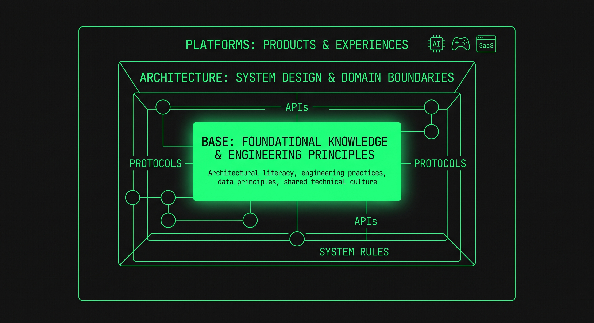

# BAP — Base · Architecture · Platforms

<div align="center">
  

  <p>
    <a href="https://www.apache.org/licenses/LICENSE-2.0"></a>
    <a href="https://creativecommons.org/licenses/by-sa/4.0/"></a>
  </p>
</div>

<div align="center">
  
  <p><em>Base sustains Architecture; Architecture enables Platforms.</em></p>
</div>

## Manifesto

[ 🇧🇷 Português ](#portugues) | [ 🇺🇸 English ](#english) | [ 🇪🇸 Español ](#espanol)

---

<details id="portugues" open>
<summary><b>🇧🇷 Português</b></summary>

<br>

Princípios de arquitetura, domínio e construção de software para plataformas escaláveis, produtos interativos e sistemas impulsionados por Inteligência Artificial.

> [!TIP]
> Inspirado na padronização e adoção dos [12 Factor Apps](https://12factor.net/) e no modelo consistente da CNCF construindo estruturas confiáveis como o [CNCF Landscape](https://landscape.cncf.io/) como referência comum em arquitetura nas empresas. **BAP não tem relação institucional com essas entidades**; elas servem apenas como inspiração.

🇧🇷 Português | Ativo | [manifesto_pt](manifesto/pt/README.md)

</details>

<details id="english">
<summary><b>🇺🇸 English</b></summary>

<br>

Architecture, domain, and software engineering principles for scalable platforms, interactive products, and AI-driven systems.

> [!TIP]
> Inspired by the standardization and adoption of [12 Factor Apps](https://12factor.net/) and the consistent CNCF model building reliable frameworks such as the [CNCF Landscape](https://landscape.cncf.io/) as a common architecture baseline across enterprises. **BAP has no institutional affiliation with these entities**; they serve strictly as inspiration.

🇺🇸 English | Active | [manifesto_en](manifesto/en/README.md)

</details>

<details id="espanol">
<summary><b>🇪🇸 Español</b></summary>

<br>

Principios de arquitectura, dominio y construcción de software para plataformas escalables, productos interactivos y sistemas impulsados por Inteligencia Artificial.

> [!TIP]
> Inspirado en la estandarización y adopción de los [12 Factor Apps](https://12factor.net/) y en el modelo consistente de la CNCF construyendo estructuras confiables como el [CNCF Landscape](https://landscape.cncf.io/) como referencia común de arquitectura en las empresas. **BAP no tiene relación institucional con estas entidades**; sirven únicamente como inspiración.

🇪🇸 Español | Activo | [manifesto_es](manifesto/es/README.md)

</details>


## Pilares

Cada pilar do manifesto será mostrado com exemplos:

| Pilar | Descrição | PT | EN | ES |
|-------|-----------|----|----|----|
| **BASE** | Domínio, Fundação & Resiliência | [base](manifesto/pt/base.md) | [base](manifesto/en/base.md) | [base](manifesto/es/base.md) |
| **ARCHITECTURE** | Engenharia, Evolução Contínua & Inteligência | [architecture](manifesto/pt/architecture.md) | [architecture](manifesto/en/architecture.md) | [architecture](manifesto/es/architecture.md) |
| **PLATFORMS** | Produtos, Jogos & Responsabilidade | [platforms](manifesto/pt/platforms.md) | [platforms](manifesto/en/platforms.md) | [platforms](manifesto/es/platforms.md) |

## Repository

```text
.
├── README.md                 # Hub do projeto
├── LICENSE
├── assets/
│   ├── bap_logo.png
│   └── bap_structure.jpeg
└── manifesto/
    ├── pt/                   # Português (fonte atual)
    │   ├── README.md         # Manifesto
    │   ├── base.md
    │   ├── architecture.md
    │   └── platforms.md
    ├── en/                   # English
    └── es/                   # Español
```

**BAP Tech Studio** — *Base • Architecture • Platforms*
