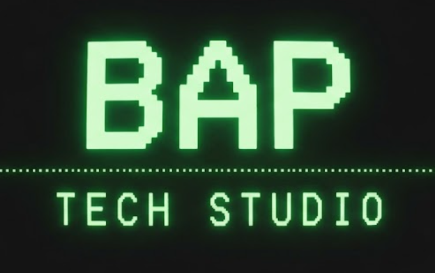

# MANIFIESTO BAP — Principles for Base · Architecture · Platform

  

  

    
    
  

  

    <a href="../pt/README.md">PT</a> · <a href="../en/README.md">EN</a> · <strong>ES</strong>
  

*Este manifiesto se inspira en el espíritu de estandarización y adopción de los [12 Factor Apps](https://12factor.net/) y, de forma aún más fuerte, en el modelo de la [CNCF](https://www.cncf.io/) de mantener estructuras confiables y ampliamente aceptadas por la comunidad tech — incluido el [CNCF Landscape](https://landscape.cncf.io/), referencia común para definiciones técnicas de arquitectura en las empresas. También dialoga con publicaciones Well-Architected de los cloud providers.*

> [!NOTE]
> **BAP no tiene relación institucional** con los 12 Factor Apps, la CNCF, el Landscape ni los frameworks Well-Architected citados. Esas fuentes sirven **solo como inspiración** de forma, rigor y cultura de adopción — no como afiliación, respaldo ni vínculo oficial.

> [!TIP]
> Referencias de inspiración (independientes de BAP):
>
> - [12 Factor Apps](https://12factor.net/) — estandarización y adopción
> - [CNCF](https://www.cncf.io/) — estructuras confiables y aceptadas por la comunidad
> - [CNCF Landscape](https://landscape.cncf.io/) — mapa del ecosistema cloud-native usado en definiciones de arquitectura
> - [AWS Well-Architected Framework](https://aws.amazon.com/architecture/well-architected/)
> - [Google Cloud Architecture Framework](https://cloud.google.com/architecture/framework)
> - [Azure Well-Architected Framework](https://learn.microsoft.com/azure/well-architected/)
> - [IBM Well-Architected Framework](https://www.ibm.com/think/architectures/well-architected/)

### **La ingeniería de software moderna no acepta atajos. Creamos la fundación de lo que viene a continuación.**

En el epicentro de cualquier gran innovación existe una estructura invisible, pero inquebrantable: una ingeniería deliberada que soporta la complejidad, escala con elegancia y transforma abstracciones complejas en productos extraordinarios.

Este manifiesto define los principios de arquitectura, dominio y construcción de software que orientan la creación de plataformas escalables, productos interactivos y sistemas impulsados por Inteligencia Artificial.

---

### I. **BASE** *(Dominio, Fundación y Resiliencia)*

Toda gran visión exige un suelo firme. Los sistemas de alta escala y disponibilidad no aceptan improvisos y nacen del entendimiento profundo del negocio.

* **Comprensión del negocio como premisa:** No existe arquitectura fuerte sin dominio del contexto. Entender los dominios de negocio que el software toca es el primer paso para determinar cómo debe diseñarse y construirse.
* **La estabilidad precede a la innovación:** Ningún algoritmo avanzado sustituye un cimiento frágil. La infraestructura y el modelado de datos deben diseñarse para soportar alta carga, concurrencia severa y crecimiento exponencial.
* **Aislamiento y previsibilidad:** Los componentes deben ser autónomos y tolerantes a fallos. La infraestructura de base debe ser estrictamente determinista, observable y resiliente, garantizando que fallos puntuales jamás comprometan el ecosistema.
* **Arquitectura en todos los niveles:** Todo profesional de TI necesita conocer arquitectura, en profundidades distintas según su función. Del conocimiento más superficial al más profundo, cada capa amplía la calidad de las decisiones.

→ [Página del pilar BASE — ejemplos](base.md)

---

### II. **ARCHITECTURE** *(Ingeniería, Evolución Continua e Inteligencia)*

Diseñar sistemas es prever el comportamiento de la tecnología bajo estrés y permitir entregas ágiles con pasos firmes y consistentes.

* **Evolución incremental con pasos firmes:** El tiempo de mercado (*time-to-market*) exige entregas por partes, pero agilidad no significa fragilidad. El valor debe entregarse de forma iterativa y consistente, sin sacrificar la estabilidad arquitectónica en cada lanzamiento.
* **Eficiencia y confianza antes de la inversión masiva:** Una empresa no necesita gastar millones para probar una nueva funcionalidad cuando posee un sistema confiable, modular y con contratos bien definidos.
* **Inteligencia y flexibilidad sin acoplamiento:** La Inteligencia Artificial y el modelado de datos avanzado potencian la toma de decisión en tiempo real, sostenidas por patrones que permiten la evolución continua de la plataforma sin reconstruirla desde cero.

→ [Página del pilar ARCHITECTURE — ejemplos](architecture.md)

---

### III. **PLATFORMS** *(Productos, Juegos y Responsabilidad)*

La arquitectura solo cumple su papel cuando se materializa en productos funcionales, seguros y alineados con el impacto que causan en los usuarios.

* **Desarrollo de juegos con responsabilidad:** Sea en juegos de entretenimiento o en experiencias inmersivas, la búsqueda del engagement y de la diversión del jugador debe ir acompañada del compromiso ético y de la responsabilidad sobre el comportamiento y los impactos del software.
* **De la infraestructura a la experiencia fluida:** Sea una plataforma transaccional de altísima frecuencia, un SaaS corporativo o una experiencia interactiva, la complejidad técnica debe abstraerse en una interfaz rápida, segura e intuitiva.
* **Rendimiento y calidad ética como estándar:** Latencia reducida, transparencia, seguridad de datos y eficiencia computacional no son diferenciales; son requisitos básicos de ingeniería y respeto al usuario final.

→ [Página del pilar PLATFORMS — ejemplos](platforms.md)

---

> **La excelencia técnica y la responsabilidad de construcción no son un destino; son el estándar.**

**BAP Tech Studio**

*Base • Architecture • Platforms*
